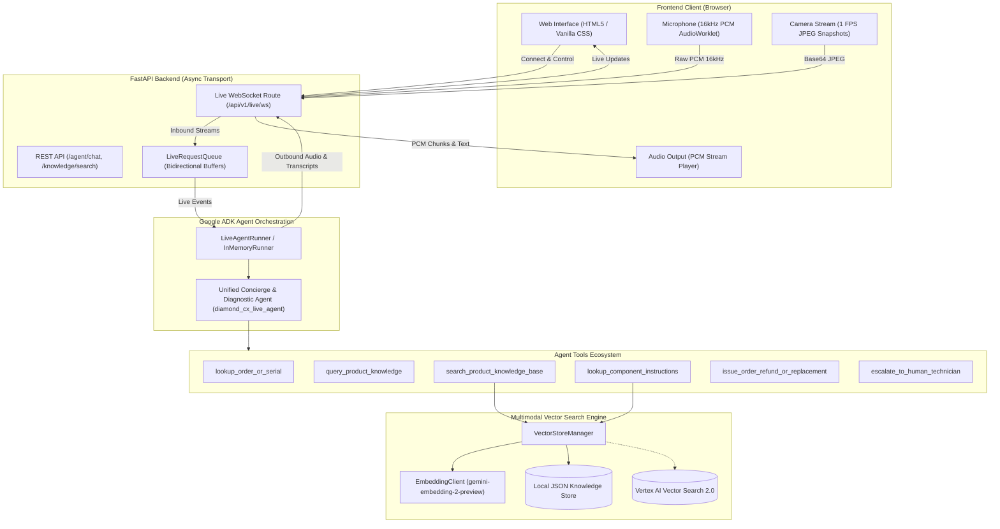
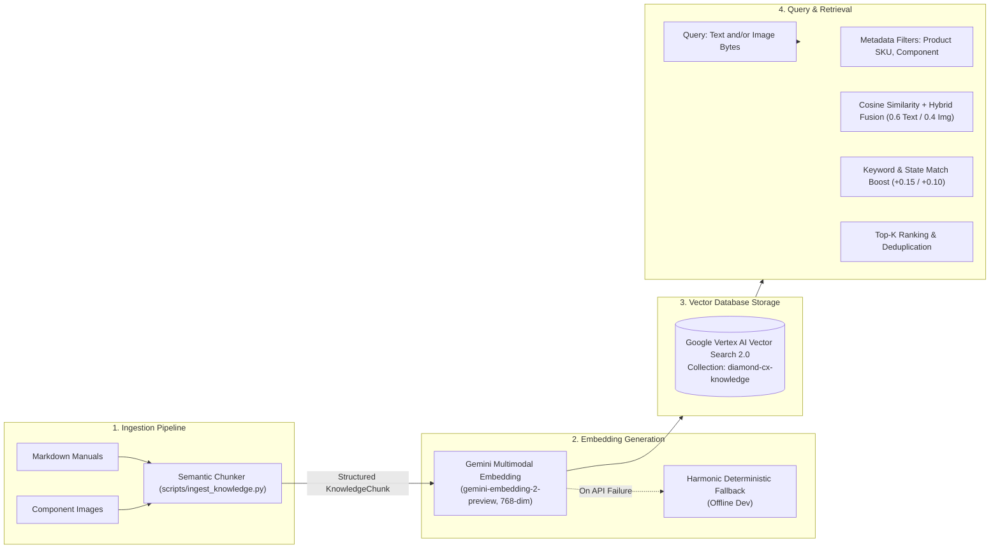
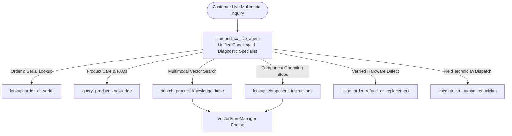
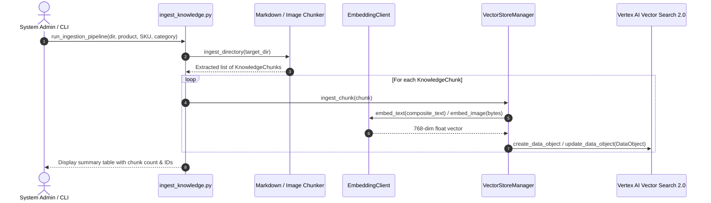
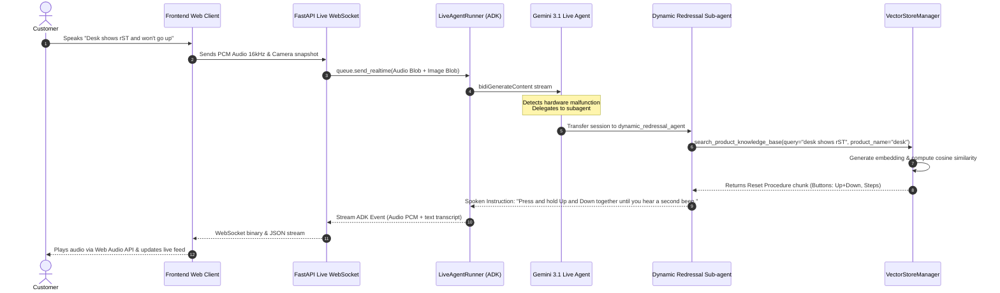
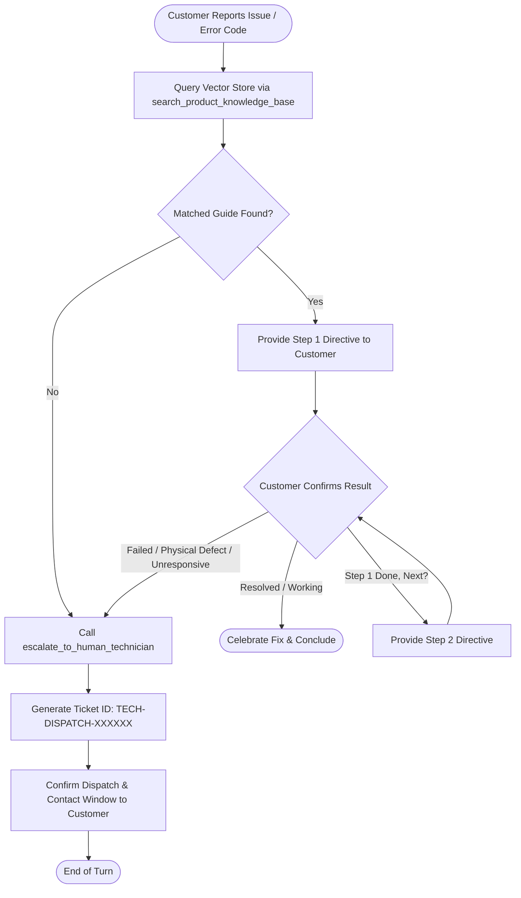

# Diamond CX: System Architecture & Vector Search Flow Documentation

Comprehensive documentation of the **Diamond CX** real-time multimodal customer experience platform, with focus on the architecture, multimodal vector search engine, ingestion pipeline, dynamic redressal flows, and Google Agent Development Kit (ADK) integration.

---

## Table of Contents
1. [Executive Summary & Tech Stack](#1-executive-summary--tech-stack)
2. [End-to-End System Architecture](#2-end-to-end-system-architecture)
3. [Multimodal Vector Search & Retrieval Engine](#3-multimodal-vector-search--retrieval-engine)
   - [A. Architecture & Design Principles](#a-architecture--design-principles)
   - [B. Data Ingestion & Semantic Chunking Pipeline](#b-data-ingestion--semantic-chunking-pipeline)
   - [C. Knowledge Chunk Schema & Metadata Model](#c-knowledge-chunk-schema--metadata-model)
   - [D. Multimodal Embedding Generation](#d-multimodal-embedding-generation)
   - [E. Similarity Calculation, Hybrid Fusion & Scoring Mechanics](#e-similarity-calculation-hybrid-fusion--scoring-mechanics)
   - [F. Storage Layers: Vertex AI Vector Search 2.0 & Local Cache](#f-storage-layers-vertex-ai-vector-search-20--local-cache)
4. [Agent Hierarchy & Tool Integration](#4-agent-hierarchy--tool-integration)
   - [A. Primary Concierge vs. Dynamic Redressal Specialist](#a-primary-concierge-vs-dynamic-redressal-specialist)
   - [B. Tool Execution & Knowledge Extraction](#b-tool-execution--knowledge-extraction)
5. [Complete End-to-End Execution Flows](#5-complete-end-to-end-execution-flows)
   - [Flow 1: Document Ingestion & Vector Indexing](#flow-1-document-ingestion--vector-indexing)
   - [Flow 2: Real-time Live Multimodal Support Stream](#flow-2-real-time-live-multimodal-support-stream)
   - [Flow 3: Dynamic Redressal & Technician Escalation Workflow](#flow-3-dynamic-redressal--technician-escalation-workflow)
6. [API & CLI Reference](#6-api--cli-reference)
   - [REST Endpoints](#rest-endpoints)
   - [CLI Ingestion Tool](#cli-ingestion-tool)
7. [Source File & Code Reference Map](#7-source-file--code-reference-map)

---

## 1. Executive Summary & Tech Stack

**Diamond CX** is a production-grade multimodal customer concierge and technical support platform. It seamlessly blends:
- **Live Multimodal Bidirectional Streaming**: Real-time voice interaction via 16kHz PCM audio, live webcam video snapshot analysis, and interactive text input.
- **Multimodal Vector RAG (Retrieval-Augmented Generation)**: Ingests technical hardware documentation, diagrams, component photos, and operating procedures into a unified 768-dimensional embedding space using `gemini-embedding-2-preview`.
- **Dynamic Redressal Agent**: Sub-agent specialized in step-by-step diagnostic guidance, interactive hardware troubleshooting, and automatic technician dispatch escalation.

### Technology Stack
- **Agent Framework**: [Google Agent Development Kit (`google-adk`)](https://github.com/google/adk-python)
- **Generative AI Models**:
  - `gemini-3.1-flash-live-preview` (Bidirectional real-time voice, video, and tool execution)
  - `gemini-2.5-flash` (Unary REST conversations)
  - `gemini-embedding-2-preview` (Multimodal text & image dense embeddings)
- **Backend**: FastAPI, `pydantic-settings`, `uvicorn`, `uv` package manager
- **Vector Search**: Google Cloud Vertex AI Vector Search 2.0 (`DataObjectSearchServiceClient`) with local persistent JSON index fallback
- **Frontend**: Vanilla JavaScript (ES Modules), Web Audio API (16kHz PCM AudioWorklet), Canvas Live Waveform Visualizer, MediaDevices Camera API

---

## 2. End-to-End System Architecture



---

## 3. Multimodal Vector Search & Retrieval Engine

### A. Architecture & Design Principles

The vector search subsystem is implemented in [`backend/app/vector_search.py`](file:///Users/aswath.s/Documents/personal/projects/diamond-cx/backend/app/vector_search.py). It addresses key hardware customer support requirements:
1. **Multimodal Co-embedding**: Maps customer text queries, error codes, manual descriptions, and component images (e.g. photos of control panels, reset buttons, and loose prongs) into the exact same 768-dimensional semantic space.
2. **Hybrid RRF / Weighted Scoring**: Blends text and image modalities when both are provided during live video-assisted troubleshooting.
3. **Domain-Specific Keyword & State Boost**: Augments standard cosine similarity with heuristic bonuses for exact component names and button controls to avoid vector drift on technical terms.



---

### B. Data Ingestion & Semantic Chunking Pipeline

The automated ingestion pipeline is located in [`backend/scripts/ingest_knowledge.py`](file:///Users/aswath.s/Documents/personal/projects/diamond-cx/backend/scripts/ingest_knowledge.py).

#### 1. Markdown Parsing (`parse_markdown_chunks`)
- **Section Splitting**: Splits documentation along Markdown header boundaries (`#`, `##`, `###`).
- **Component Detection**: Uses regex patterns to identify named components (e.g., `switcher`, `control panel`, `display`, `sensor`, `motor`, `prong`, `clasp`).
- **State & Option Extraction**: Extracts supported modes and button inputs (e.g., `Buttons: Up, Down, 1, 2, 3, M, T` or `Modes: BT1, BT2, 2.4G`).
- **Step Isolation**: Detects numbered steps (`1.`, `Step 2:`, `*`) and separates them into an actionable `instructions` list.
- **Classification**: Assigns `content_type` as `"procedure"` if actionable steps exist, or `"spec"` for general technical specifications.

#### 2. Image Processing (`process_image_file`)
- Scans product directories for `.png`, `.jpg`, `.jpeg`, and `.webp` images.
- Creates multimodal visual reference chunks with file paths and metadata tags.

#### 3. Composite Embedding Serialization
Before sending chunks to the embedding model, a rich composite text string is created:
```text
Product: JIN OFFICE Electric Sit-Stand Desk (Model JHT8-ED3)
Category: Demonstration Hardware
Component: Control Panel
Title: System Reset Procedure ("rST")
Content: Press and hold the "Up" and "Down" buttons simultaneously...
Controls/Options: Up, Down, 1, 2, 3, M, T
Instructions: Press and hold the "Up" and "Down" buttons simultaneously. Wait for display to show "rST". Never release until second beep.
```

---

### C. Knowledge Chunk Schema & Metadata Model

Defined in [`backend/app/models.py`](file:///Users/aswath.s/Documents/personal/projects/diamond-cx/backend/app/models.py#L50-L71):

```python
class KnowledgeChunk(BaseModel):
    id: str                               # Unique chunk ID (e.g. PROD-DESK-001_manual_3_a9b1)
    product_id: str                       # Product SKU (e.g. PROD-DESK-001)
    product_name: str                     # Human readable product name
    category: str                         # e.g. "Electronics", "Ergonomic Hardware"
    component_name: str | None            # e.g. "control panel", "bluetooth switcher"
    content_type: str                     # "procedure", "spec", "image", "faq"
    title: str                            # Step heading or section title
    text_content: str                     # Raw section text or guide
    image_path: str | None                # Optional path to component visual reference
    step_number: int | None               # Sequential step index
    possible_states_or_options: list[str] # List of button labels or modes
    instructions: list[str]               # Step-by-step actionable directives
    embedding: list[float] | None         # Dense 768-dimensional float vector
    metadata: dict[str, Any]              # Source file name, timestamps, tags

class VectorSearchResult(BaseModel):
    chunk: KnowledgeChunk
    similarity_score: float
    matched_modality: str                 # "text", "image", or "hybrid"
```

---

### D. Multimodal Embedding Generation

The `EmbeddingClient` in [`backend/app/vector_search.py`](file:///Users/aswath.s/Documents/personal/projects/diamond-cx/backend/app/vector_search.py#L76-L172) generates vectors:

1. **Client Initialization**: Configured for Vertex AI (`vertexai=True`, project, location) or direct Gemini API key access.
2. **Text Embedding**: Calls `client.models.embed_content()` with `contents=text` and `output_dimensionality=768`.
3. **Image Embedding**: Wraps raw bytes as `types.Part.from_bytes(data=image_bytes, mime_type="image/jpeg")`.
4. **Retry Mechanism with Exponential Backoff**: Automatically catches HTTP 429 (`RESOURCE_EXHAUSTED`) and retries up to 3 times with exponential backoff (`0.5s`, `1.0s`, `2.0s`).
5. **Deterministic Mock Generator**: For offline local development without active API keys, a fallback pseudo-vector generator uses SHA-256 seed hashing combined with harmonic wave distribution:
   $$v_i = \left(\frac{\text{hash}[i \pmod{32}]}{127.5} - 1.0\right) + 0.2 \cdot \sin(0.1 \cdot i)$$
   normalized to unit length: $\hat{\mathbf{v}} = \frac{\mathbf{v}}{\|\mathbf{v}\|_2}$.

---

### E. Similarity Calculation, Hybrid Fusion & Scoring Mechanics

#### 1. Cosine Similarity Formula
$$\text{Cosine Similarity}(\mathbf{u}, \mathbf{v}) = \frac{\mathbf{u} \cdot \mathbf{v}}{\|\mathbf{u}\|_2 \|\mathbf{v}\|_2} = \frac{\sum_{i=1}^{n} u_i v_i}{\sqrt{\sum_{i=1}^{n} u_i^2} \sqrt{\sum_{i=1}^{n} v_i^2}}$$

#### 2. Hybrid Scoring Logic
```python
if text_vec and image_vec:
    # Hybrid multimodal weighted score
    score_text = _cosine_similarity(text_vec, chunk.embedding)
    score_img = _cosine_similarity(image_vec, chunk.embedding)
    score = (score_text * 0.6) + (score_img * 0.4)
    modality = "hybrid"
elif text_vec:
    score = _cosine_similarity(text_vec, chunk.embedding)
    modality = "text"
elif image_vec:
    score = _cosine_similarity(image_vec, chunk.embedding)
    modality = "image"
```

#### 3. Domain-Specific Keyword Boost
To prevent vector "drift" on specific component names or button states:
```python
if query_text:
    q_lower = query_text.lower()
    # +0.15 boost if exact component name is mentioned
    if chunk.component_name and chunk.component_name.lower() in q_lower:
        score += 0.15
    # +0.10 boost if any button/state matches query
    if any(opt.lower() in q_lower for opt in chunk.possible_states_or_options):
        score += 0.10
```

#### 4. Post-Filtering & Thresholding
- **Score Threshold**: Rejects results below `min_score = 0.25`.
- **Metadata Filters**: Optional pre-filtering by `product_name`, `product_id`, or `component_name`.
- **Top-K Ranking**: Sorted by `similarity_score` descending, returning the top $K$ results (default `top_k = 4`).

---

### F. Storage Layer: Google Cloud Vertex AI Vector Search 2.0

The `VectorStoreManager` stores and retrieves all data directly from **Google Cloud Vertex AI Vector Search 2.0** (`google.cloud.vectorsearch_v1`):
- **Live Cloud Collection**: `projects/steam-lock-325205/locations/us-central1/collections/diamond-cx-knowledge`.
- **DataObject Model**: Stores chunk content, step instructions, component states, and metadata directly in Protobuf `Struct` payloads alongside `text_emb` and `image_emb` 768-dimensional dense vectors.
- **Direct Search & Query**: Queries use `DataObjectSearchServiceClient.search_data_objects` and `DataObjectSearchServiceClient.query_data_objects` with `OutputFields(data_fields=['*'])`.

---

## 4. Agent Hierarchy & Tool Integration



### A. Unified Concierge & Diagnostic Specialist Architecture
The system employs a single, unified high-performance agent (`diamond_cx_live_agent` / `diamond_cx_agent`) that natively incorporates all concierge, order tracking, and technical diagnostic capabilities with **zero handoff latency**.

### B. Observant & Verification-First Protocol
1. **Multimodal Visual Grounding**: Continuously inspects the live 1 FPS camera frames to visually verify component states, LED alphanumeric displays (`rST`, `E01`, `HOT`, `E04`), cable seating, and user button presses before proceeding.
2. **Strict Step-by-Step Isolation**: Delivers exactly ONE actionable instruction at a time rather than overwhelming the customer with an entire procedure manual.
3. **Verification & Ground-Truth Probing**: Probes for specific physical symptoms, sensory cues (e.g. audible relay clicks, number of beeps), and display codes that only an active user performing the step would know.
4. **Anti-Bypass Guardrails**: Refuses unverified shortcut refund claims; requires verified diagnostic failure before executing high-impact redressal tools (`issue_order_refund_or_replacement`).

### C. Tool Execution & Knowledge Extraction
- [`search_product_knowledge_base`](file:///Users/aswath.s/Documents/personal/projects/diamond-cx/backend/app/tools.py#L189-L242): Queries the vector store with user query text and optional product/component filters. Returns matching chunks with similarity scores and actionable steps.
- [`lookup_component_instructions`](file:///Users/aswath.s/Documents/personal/projects/diamond-cx/backend/app/tools.py#L244-L283): Direct component retrieval returning all associated buttons, states, and sequential operating steps.
- [`escalate_to_human_technician`](file:///Users/aswath.s/Documents/personal/projects/diamond-cx/backend/app/tools.py#L289-L327): Registers a dispatch ticket `TECH-DISPATCH-XXXXXX` and provides customer confirmation.

---

## 5. Complete End-to-End Execution Flows

### Flow 1: Document Ingestion & Vector Indexing



---

### Flow 2: Real-time Live Multimodal Support Stream



---

### Flow 3: Dynamic Redressal & Technician Escalation Workflow



---

## 6. API & CLI Reference

### REST Endpoints

#### 1. Vector Search Query
```http
GET /api/v1/knowledge/search?query={query}&product={product}&component={component}&top_k={top_k}
```
**Example Response**:
```json
{
  "query": "reset desk rST",
  "matched_count": 1,
  "results": [
    {
      "chunk_id": "PROD-DESK-001_manual_3_9fc2",
      "product_name": "JIN OFFICE Electric Sit-Stand Desk (Model JHT8-ED3)",
      "category": "Demonstration Hardware",
      "component": "System Reset Procedure (\"rST\")",
      "title": "System Reset Procedure (\"rST\")",
      "content": "Press and hold the \"Up\" and \"Down\" buttons simultaneously...",
      "controls_or_options": ["Up", "Down", "1", "2", "3", "M", "T"],
      "instructions": [
        "Press and hold the \"Up\" and \"Down\" buttons simultaneously.",
        "The unit will emit one beep, and the display will show \"rST\" as the desk starts moving downward to its lowest position.",
        "Never release the buttons until the unit emits a second beep and the desk moves upward a little, indicating the reset is finished."
      ],
      "similarity_score": 0.8842,
      "modality": "text"
    }
  ]
}
```

#### 2. Ingested Products Summary
```http
GET /api/v1/knowledge/products
```

#### 3. Clear All or Specific Product from Knowledge Collection
```http
# Delete all data objects in the collection
DELETE /api/v1/knowledge/clear

# Delete all chunks for a specific Product ID or SKU
DELETE /api/v1/knowledge/products/{product_id}
```

#### 4. Agent Info & Health
```http
GET /api/v1/agent/info
GET /api/v1/health
```

---

### CLI Ingestion Tool

Run the interactive ingestion CLI or batch process sample manuals:

```bash
# 1. Clear a specific product only (by Product ID, SKU, or Name)
uv run python scripts/ingest_knowledge.py --clear-product PROD-HD-1212

# 2. Clear entire collection only
uv run python scripts/ingest_knowledge.py --clear-only

# 3. Clear collection AND re-ingest all built-in sample products
uv run python scripts/ingest_knowledge.py --clear --all-samples

# 4. Ingest / Upsert all built-in sample product manuals and images (without clearing)
uv run python scripts/ingest_knowledge.py --all-samples

# 5. Ingest a custom product directory
uv run python scripts/ingest_knowledge.py \
  --dir data/sample_products/height_adjustable_desk \
  --name "Electric Sit-Stand Desk" \
  --id "PROD-DESK-001" \
  --category "Ergonomic Hardware"
```

---

## 7. Source File & Code Reference Map

| Component | Primary File | Responsibilities |
|---|---|---|
| **Multimodal Vector Engine** | [`backend/app/vector_search.py`](file:///Users/aswath.s/Documents/personal/projects/diamond-cx/backend/app/vector_search.py) | Gemini `gemini-embedding-2-preview` integration, cosine similarity, hybrid scoring, keyword boosting, local JSON persistence, and Vertex AI Vector Search 2.0 client. |
| **Ingestion CLI** | [`backend/scripts/ingest_knowledge.py`](file:///Users/aswath.s/Documents/personal/projects/diamond-cx/backend/scripts/ingest_knowledge.py) | Markdown parsing, regex extraction of buttons/states/steps, image reference processing, embedding generation, and vector index persistence. |
| **Agent Tools** | [`backend/app/tools.py`](file:///Users/aswath.s/Documents/personal/projects/diamond-cx/backend/app/tools.py) | Tool definitions: `search_product_knowledge_base`, `lookup_component_instructions`, `lookup_order_or_serial`, `query_product_knowledge`, `escalate_to_human_technician`. |
| **Primary Live Agent** | [`backend/app/live_agent.py`](file:///Users/aswath.s/Documents/personal/projects/diamond-cx/backend/app/live_agent.py) | Google ADK Live Runner setup, `gemini-3.1-flash-live-preview` configuration, bidirectional voice/video session state lifecycle. |
| **Redressal Sub-Agent** | [`backend/app/redressal_agent.py`](file:///Users/aswath.s/Documents/personal/projects/diamond-cx/backend/app/redressal_agent.py) | Interactive step-by-step diagnostic specialist with auto-resolution bias and escalation triggers. |
| **REST & WebSocket Routes** | [`backend/app/live_routes.py`](file:///Users/aswath.s/Documents/personal/projects/diamond-cx/backend/app/live_routes.py), [`backend/app/routes.py`](file:///Users/aswath.s/Documents/personal/projects/diamond-cx/backend/app/routes.py) | Upstream and downstream streaming loops, REST chat endpoints, and direct vector search API (`/knowledge/search`). |
| **Data Models** | [`backend/app/models.py`](file:///Users/aswath.s/Documents/personal/projects/diamond-cx/backend/app/models.py) | Pydantic schemas for `KnowledgeChunk`, `VectorSearchResult`, `EscalationTicket`, etc. |
| **Configuration** | [`backend/app/config.py`](file:///Users/aswath.s/Documents/personal/projects/diamond-cx/backend/app/config.py) | Pydantic Settings for models, API keys, voice selection, embedding dimensions (768), and GCP project settings. |
| **Frontend Web Client** | [`frontend/app.js`](file:///Users/aswath.s/Documents/personal/projects/diamond-cx/frontend/app.js), [`frontend/index.html`](file:///Users/aswath.s/Documents/personal/projects/diamond-cx/frontend/index.html) | Live audio/video streaming client, PCM AudioWorklet, canvas visualizer, and live interaction feed. |
